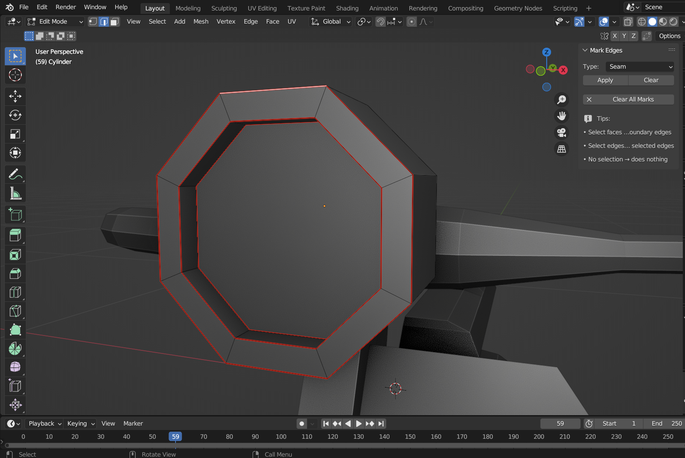

# Mark Edges Addon for Blender

**Mark Edges** is a simple but powerful addon for Blender 3.6+ that allows you to quickly mark or clear **Seam** and **Sharp** edges based on your current selection.

## Features

- **Smart selection handling**:
  - If you have **faces selected**, it marks the *boundary edges* of that selection (edges that separate selected from unselected faces).
  - If you have **edges selected**, it marks exactly those edges.
  - If you have **vertices selected**, it marks the edges that connect them.
- **Two main actions**: Apply or Clear the chosen mark type.
- **Clear All**: Removes **all** Seam and Sharp marks from the entire mesh at once.
- **Live feedback**: Shows how many edges were affected in the last operation.
- **Clean UI**: All controls are in a dedicated panel in the 3D View sidebar.

## Installation

1. Download the `mark_edges_addon.py` file.
2. Open Blender and go to **Edit → Preferences → Add-ons**.
3. Click **Install…** and select the downloaded file.
4. Enable the addon by checking the box next to **"Mark Edges (Seam/Sharp)"**.
5. The panel will appear in the 3D View sidebar (**N** key) under the **"Mark Edges"** tab.

## Usage

1. Enter **Edit Mode** on a mesh object.
2. Select **faces**, **edges**, or **vertices** (depending on what you want to affect).
3. In the sidebar (**N**), go to the **Mark Edges** tab.
4. Choose the mark type (Seam or Sharp) from the dropdown.
5. Click **Apply** to add the mark, or **Clear** to remove it.
6. Use **Clear All** to wipe all marks from the entire mesh.

## Tips

- The addon only works in **Edit Mode**.
- If you select faces, only the boundary edges of that selection are affected – this is ideal for UV unwrapping (Seam) or defining hard edges (Sharp).
- The panel shows how many edges were changed in the last operation, so you always know what happened.

## License

This project is licensed under the MIT License – see the [LICENSE](LICENSE) file for details.
